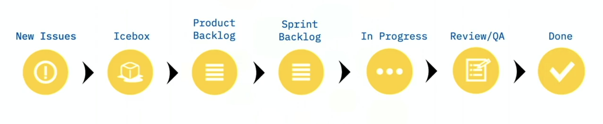
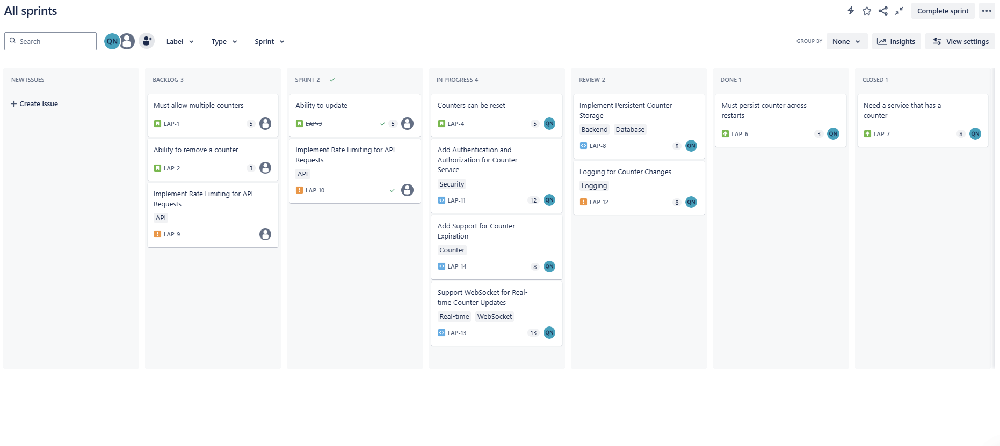
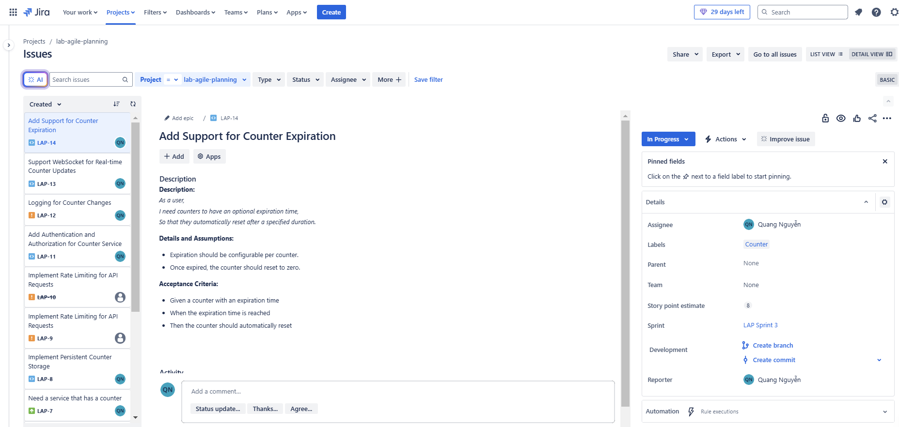
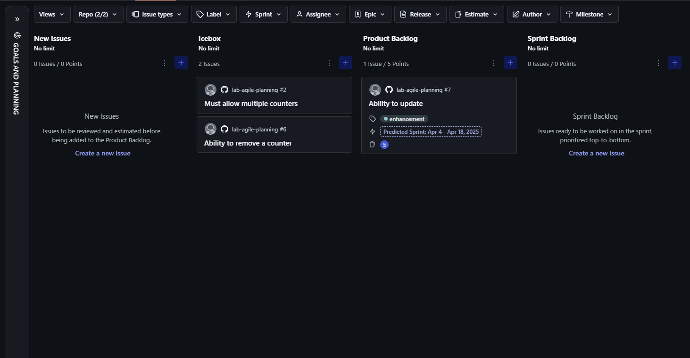

# 🎯lab-agile-planning

## Project Overview  
**lab-agile-planning** is a project focused on **Agile project management and backlog planning**. I did in Jira, ZenHub (GitHub ext)

## Key Features  
- **Structured User Stories** follow the INVEST principle  
- **Story Point estimation** using T-Shirt sizing (XS:3 , S:5, M:8, L:13, XL:21)  
- **Board setup** with workflow of: New issues, Backlog, Sprint, In-process, Review, Done, Close 
- **Issue Type classification**: Feature, Bug, Technical Debt, Enhancement,...
- **Sprint planning**: 25-30 points per Sprint for a 7-person team

## Details and Assumptions
```
It includes the technical and business constraints.
It states any dependencies or assumptions about the system.
It clarifies expectations that may not be directly mentioned in the User Story.
```
## User Story Structure  
I follow a structured User Story format:

```gherkin
As a [type of user],  
I need [a feature or functionality],  
So that [benefit or value].
```

## Acceptance Criteria
I follow a structured Acceptance Criteria format:
 ```
 Given [some context]
 When [certain action is taken]
 Then [the outcome of action is observed]
 ```

### Here is Description example
#### Description
**As a** user,\
**I need** counters to have an optional expiration time,\
**So that** they automatically reset after a specified duration.
   
 #### Details and Assumptions
 * Expiration should be configurable per counter.
 * Once expired, the counter should reset to zero.
   
 #### Acceptance Criteria  
**Given** a counter with an expiration time  
**When** the expiration time is reached  
**Then** the counter should automatically reset  

## Image and links Project here:
### I do the board by workflow:


### Deployed in Jira
#### Workflow Board in Jira

##### [View directly the Board on Jira](https://nguyendinhquang2004adc.atlassian.net/jira/software/projects/LAP/boards/3)

#### All issues, sprints of Project


#### Workflow Board in ZenHub

##### [View directly the Board on ZenHub](https://github.com/ndq-wpz/lab-agile-planning/issues#workspaces/ndq-67cab8d47be48a001c1ba418/board?repos=944383661)


